# Vulpix
[](https://deepwiki.com/rexdotsh/vulpix)

> [!NOTE]
> Winner of the [Polkadot AssetHub Hackathon](https://dorahacks.io/hackathon/polkadot/) (1st place).

A blockchain-based NFT battle platform that combines AI-generated artwork with strategic turn-based combat. Built on Polkadot AssetHub with smart contract integration via PolkaVM.

**Live Demo:** [vulpix.rex.wf](https://vulpix.rex.wf)

## Overview

Vulpix is a decentralized application (dApp) that enables users to create, manage, and battle with AI-generated NFTs across multiple blockchain networks. The platform leverages Polkadot AssetHub for NFT ownership and storage, while utilizing Ethereum-compatible smart contracts through PolkaVM for battle logic execution.

Key features include AI-powered NFT artwork generation, strategic turn-based battles, and comprehensive digital asset management through a modern, responsive web interface.

## System Architecture

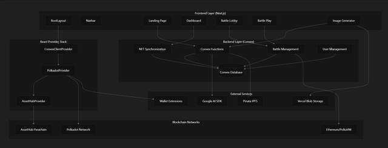

The platform is built on several interconnected subsystems:

| Component | Technology | Primary Function |
|-----------|------------|------------------|
| Frontend Application | Next.js 15.3.3 | User interface and client-side logic |
| Backend Services | Convex | Real-time database and serverless functions |
| Blockchain Integration | Polkadot API, Ethers.js | Multi-chain wallet and contract interaction |
| AI Image Generation | Google AI SDK | NFT artwork creation and processing |
| Storage Layer | Vercel Blob, Pinata IPFS | Decentralized and centralized asset storage |

## Data Flow Architecture

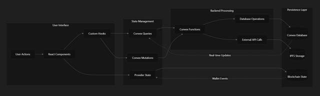

The platform operates on a reactive architecture where user interactions trigger cascading updates through the provider hierarchy, backend functions, and ultimately to persistent storage layers. Real-time synchronization ensures that all connected clients receive immediate updates when system state changes occur.

## Provider Hierarchy
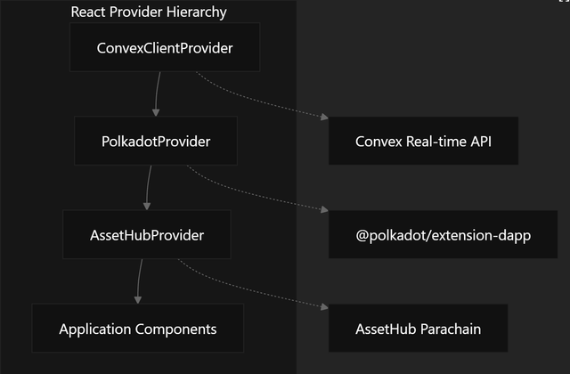

## Technology Stack

### Frontend Technologies
- **Next.js 15.3.3**: React framework with App Router and Turbopack
- **React 19**: Latest React version with concurrent features
- **Tailwind CSS 4**: Utility-first styling framework
- **Framer Motion**: Animation and gesture library
- **Radix UI**: Headless component primitives

### Backend and Database
- **Convex**: Real-time backend-as-a-service with TypeScript support
- **Generated APIs**: Type-safe client-server communication

### Blockchain Integration
- **Polkadot API (@polkadot/api)**: Core blockchain interaction
- **Extension Integration (@polkadot/extension-dapp)**: Wallet connectivity
- **Ethers.js**: Ethereum smart contract interaction
- **AssetHub Parachain**: NFT storage and ownership

### AI and Storage
- **Google AI SDK (@ai-sdk/google)**: Gemini model integration
- **Vercel Blob**: Centralized blob storage
- **Pinata**: IPFS pinning service for decentralized storage

### Development Tools
- **TypeScript 5**: Type safety across the entire stack
- **Biome**: Fast linting and formatting
- **Lefthook**: Git hooks for code quality
- **Zod**: Runtime type validation

## Backend Architecture

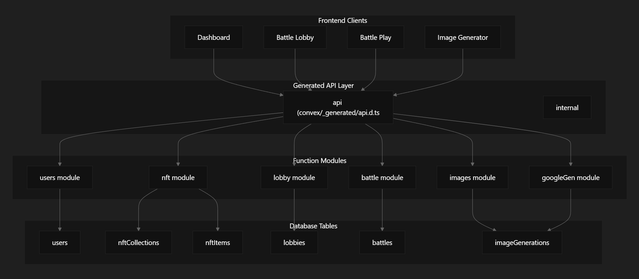

Convex serves as the primary backend platform, providing a serverless function runtime with integrated document database, real-time subscriptions, and automatic API generation. The backend is organized into six main function modules that handle different aspects of the platform's functionality.

Function modules are automatically exposed through the generated API layer, providing type-safe access from frontend components. Each module contains query functions for reading data and mutation functions for updates, all with real-time subscription capabilities.

## Core Features

### AI Image Generation

The AI-powered image generation system allows users to create custom NFT artwork using Google AI models. The system provides a complete workflow from prompt input to NFT creation, with real-time generation tracking and collection management.

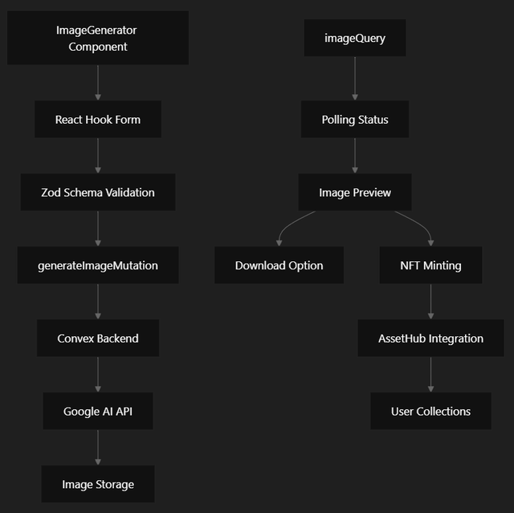

The system consists of a React-based frontend interface that communicates with Google AI models through Convex backend functions. Users can generate images using text prompts, preview results in real-time, and mint the generated images as NFTs in their AssetHub collections.

### Battle System
- **Turn-based Combat**: Strategic elements with NFT-based character battles
- **Real-time Multiplayer**: Instant updates and battle synchronization
- **Battle Analytics**: Comprehensive history and statistics tracking
- **Smart Contract Integration**: On-chain battle logic execution

### NFT Integration
- **AssetHub Support**: Native support for Polkadot AssetHub NFTs
- **AI-Generated Stats**: Battle statistics automatically generated for each NFT
- **IPFS Storage**: Decentralized metadata and image storage
- **Wallet Integration**: Seamless asset management through Polkadot extensions

### User Experience
- **Modern Interface**: Responsive web design with smooth animations
- **Seamless Wallet Connection**: Integration with popular Polkadot extensions
- **Customizable Profiles**: User profiles with image upload capabilities
- **Battle Lobby System**: Matchmaking and battle organization

## Polkadot and AssetHub Integration

The platform provides comprehensive Polkadot browser extension integration, AssetHub NFT management, and blockchain utilities that enable seamless interaction with the Polkadot ecosystem.

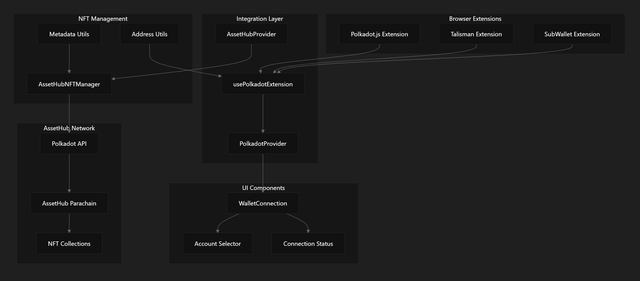

### Extension Integration

The `usePolkadotExtension` hook manages connections to Polkadot browser extensions and provides a unified interface for wallet interactions.

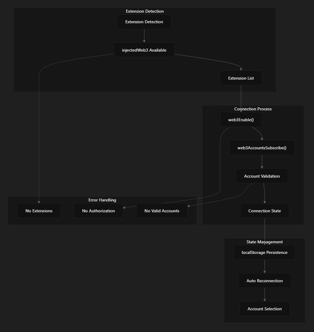

### Account Management

The account management system handles Polkadot account validation, selection, and state persistence. Connection state persists for 24 hours using localStorage and automatically reconnects on page load.

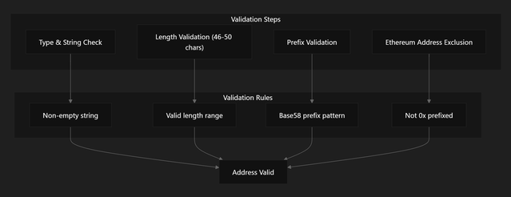

```typescript
// Connection state structure
interface ConnectionState {
  connected: boolean;
  selectedAccountIndex: number;
  timestamp: number;
}
```

## Smart Contracts and PolkaVM

The VulpixPVM smart contract serves as the core battle engine, executing turn-based combat logic on-chain while maintaining deterministic battle outcomes. The contract manages battle state, NFT stats, and move history entirely on the blockchain.

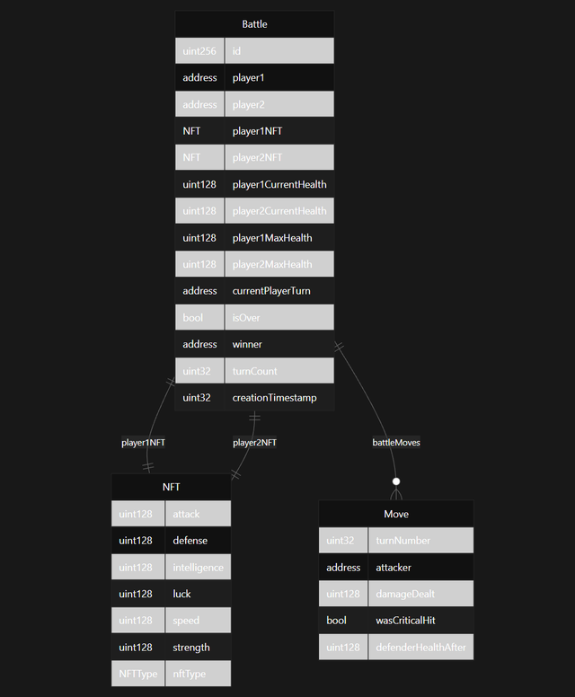

### Contract Functions

| Function | Purpose | Modifiers |
|----------|---------|-----------|
| createBattle | Initialize new battle with NFT stats | None |
| executeTurn | Process combat turn and update state | battleExists, battleIsOngoing, isPlayerTurn |
| getBattleState | Retrieve current battle state | battleExists |
| getBattleMoves | Get move history for battle | battleExists |
| getPlayerHealthPercentage | Calculate health percentage | battleExists |

### Battle Mechanics

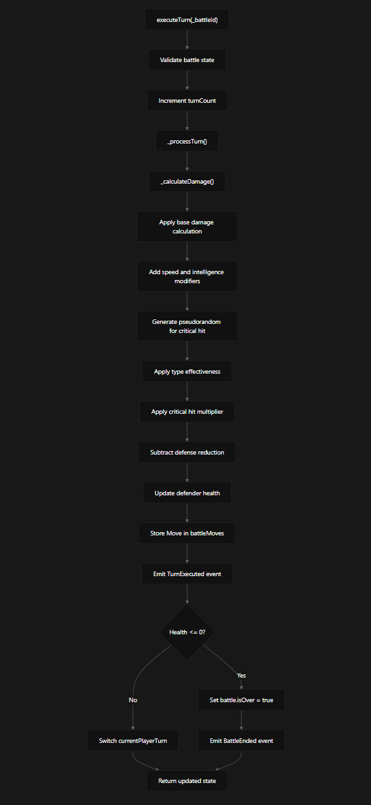

**Damage Calculation Algorithm:**
- **Base Damage**: (attack / 5) + (strength / 10)
- **Speed Modifier**: (baseDamage * speed) / (BASE_MULTIPLIER * 5)
- **Tactical Modifier**: (baseDamage * intelligence) / (BASE_MULTIPLIER * 4)
- **Critical Hit Chance**: (luck / CRITICAL_CHANCE_DIVISOR) + 5
- **Type Effectiveness**: Fire > Grass > Water > Fire (50%, 100%, 150% multipliers)
- **Defense Reduction**: (rawDamage * totalDefense) / (totalDefense + 25)

### Transaction Processing

The `handleExecuteTurn` function demonstrates the complete integration pattern:

1. **Optimistic Update**: Update Convex state immediately for UI responsiveness
2. **Wallet Connection**: Initialize ethers.BrowserProvider with window.talismanEth
3. **Contract Interaction**: Create contract instance with VulpixPVMABI and execute transaction
4. **Event Parsing**: Extract TurnExecuted and BattleEnded events from transaction receipt
5. **State Synchronization**: Update Convex with verified blockchain state
6. **Error Handling**: Revert optimistic updates on transaction failure

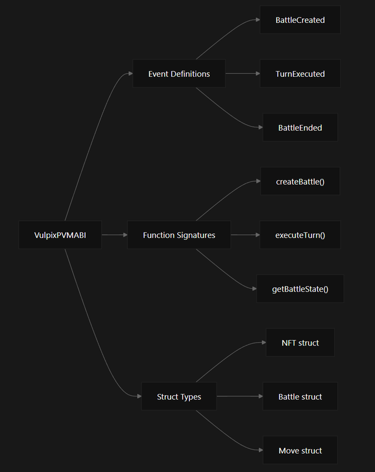

## Getting Started

### Prerequisites
- Node.js 18 or later
- Bun package manager
- Polkadot wallet extension (Polkadot.js, Talisman, etc.)
- Git

### Installation

1. **Clone the repository:**
```bash
git clone https://github.com/rexdotsh/vulpix.git
cd vulpix
```

2. **Install dependencies:**
```bash
bun install
```

3. **Configure environment variables:**
```bash
cp .env.example .env.local
```

Add these variables to `.env.local`:
```env
# Blockchain
NEXT_PUBLIC_CONTRACT_ADDRESS=your_contract_address

# IPFS
PINATA_JWT=your_pinata_jwt_token
NEXT_PUBLIC_GATEWAY_URL=your_ipfs_gateway_url

# Backend
NEXT_PUBLIC_CONVEX_URL=your_convex_url
CONVEX_DEPLOYMENT=your_convex_deployment_id
CONVEX_DEPLOY_KEY=your_convex_deploy_key

# Storage
BLOB_READ_WRITE_TOKEN=your_vercel_blob_token
```

4. **Start the development server:**
```bash
bun run dev
```

5. **Open your browser and navigate to `http://localhost:3000`**

## Usage Guide

### Getting Started with Battles

1. **Connect Your Wallet**
   - Install a Polkadot wallet extension (Polkadot.js, Talisman, etc.)
   - Connect your wallet containing AssetHub NFTs

2. **Set Up Your Profile**
   - Upload a profile picture
   - Choose your display name

3. **Select Your Battle NFT**
   - Browse your AssetHub NFT collection
   - Choose an NFT to use in battles
   - View its generated battle stats

4. **Join or Create a Battle**
   - Create a new battle lobby
   - Or join an existing lobby
   - Wait for an opponent

5. **Battle**
   - Take turns attacking your opponent
   - Use strategy based on NFT types and stats
   - Win battles to build your reputation

### Battle Mechanics

**NFT Statistics:**
- **Attack**: Base damage output
- **Defense**: Damage reduction capability
- **Speed**: Determines turn order
- **Intelligence**: Affects critical hit chance
- **Luck**: Influences random events
- **Strength**: Overall power modifier

**Type Effectiveness:**
- Fire beats Grass
- Water beats Fire
- Grass beats Water

## Project Structure

```
vulpix/
├── app/                    # Next.js app directory
│   ├── api/               # API routes
│   │   ├── ipfs/         # IPFS upload endpoints
│   │   └── profile-picture/ # Profile image upload
│   ├── battle/           # Battle pages
│   │   ├── lobby/        # Battle lobby
│   │   └── play/         # Active battle interface
│   ├── dashboard/        # User dashboard
│   └── generate/         # NFT stat generation
├── components/           # React components
│   ├── battle/          # Battle-specific components
│   ├── fancy/           # Animated UI components
│   ├── hero/            # Landing page sections
│   └── ui/              # Base UI components
├── convex/              # Convex backend
│   ├── _generated/      # Auto-generated types
│   ├── battles.ts       # Battle management
│   ├── lobbies.ts       # Lobby system
│   └── schema.ts        # Database schema
├── hooks/               # Custom React hooks
├── lib/                 # Utilities and providers
│   ├── contract/        # Smart contract code
│   └── providers/       # React context providers
└── public/              # Static assets
```

## Development

### Available Scripts

```bash
# Development
bun run dev              # Start frontend and backend
bun run dev:frontend     # Frontend only
bun run dev:backend      # Convex backend only

# Building
bun run build           # Production build
bun run build:dev       # Development build with turbopack

# Code Quality
bun run lint            # Lint with Biome
bun run format          # Format with Biome# PolkaArena

